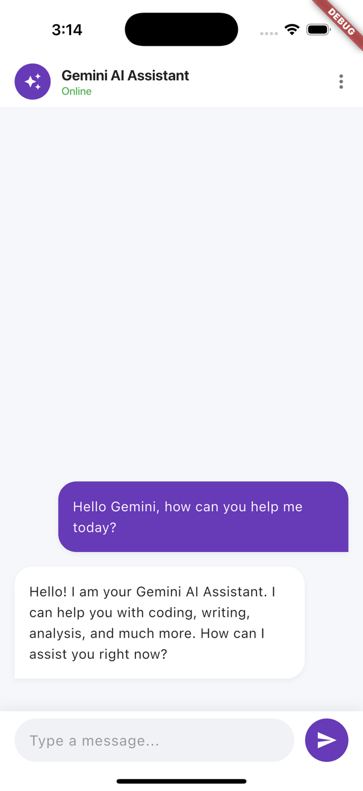

# AI-Chat (Gemini AI Assistant)

A modern AI chat application built with Flutter and Firebase AI (Gemini). This project demonstrates how to integrate Google's state-of-the-art Gemini models into a mobile application, providing a fluid, responsive, and "Good Taste" user experience.

## 📸 Screenshots

| Empty State | Chat Interface |
| :---: | :---: |
|  |  |

## ✨ Features

-   **Gemini 2.5 Flash Integration**: Leverages the latest Gemini models for high-speed, accurate AI interactions.
-   **Real-time Streaming Responses**: Implements Stream-based API for a smooth "typing" effect in conversations.
-   **Modern Material 3 UI**:
    -   Clean, bubble-style chat interface.
    -   Full Markdown rendering (including code blocks with syntax highlighting and inline images).
    -   Automatic bottom-scrolling with smooth animations.
    -   Responsive input area with physical keyboard support (Enter to send, Shift+Enter for newline).
-   **Robust Architecture**: Utilizes the BLoC (Business Logic Component) pattern for clean, predictable state management.
-   **Cross-Platform Support**: Optimized for both Android and iOS.

## 🛠 Tech Stack

-   **Core Framework**: [Flutter](https://flutter.dev) (v3.10.8+)
-   **Language**: [Dart](https://dart.dev)
-   **State Management**: [flutter_bloc](https://pub.dev/packages/flutter_bloc) (v9.1.1)
-   **AI Engine**: [firebase_ai](https://pub.dev/packages/firebase_ai) (v3.7.0)
-   **UI & Utilities**:
    -   `flutter_markdown`: For rendering AI-generated Markdown content.
    -   `url_launcher`: Handling link interactions within the chat.
    -   `equatable`: Simplified value equality in BLoC states.

## 🏗 Project Structure

The project follows a Feature-First, clean architecture approach:

```text
lib/
├── bloc/               # Core Business Logic (BLoC)
│   ├── gemini_api_bloc.dart    # Gemini API communication & stream handling
│   ├── gemini_api_event.dart   # UI Event definitions
│   ├── gemini_api_state.dart   # UI State definitions
│   └── status.dart             # Chat state enumerations (loading, success, etc.)
├── pages/              # UI Components & Pages
│   └── ai_chat_page.dart       # Primary Chat Interface
└── main.dart           # Entry point & Firebase Initialization
```

## 🚀 Getting Started

### Prerequisites

1.  Ensure you have the Flutter SDK installed.
2.  Create a project in the [Firebase Console](https://console.firebase.google.com/).
3.  Enable the **Google AI (Gemini)** service.
4.  Download `google-services.json` (Android) and `GoogleService-Info.plist` (iOS) and place them in:
    -   `android/app/google-services.json`
    -   `ios/Runner/GoogleService-Info.plist`

### Running the Project

```bash
# Fetch dependencies
flutter pub get

# Run the application
flutter run
```

## 📄 License

This project is licensed under the MIT License - see the [LICENSE](LICENSE) file for details.

---
Developed by Yomiry.
