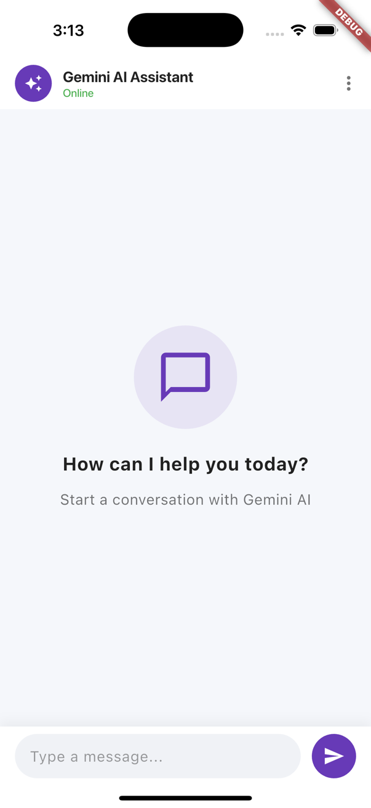
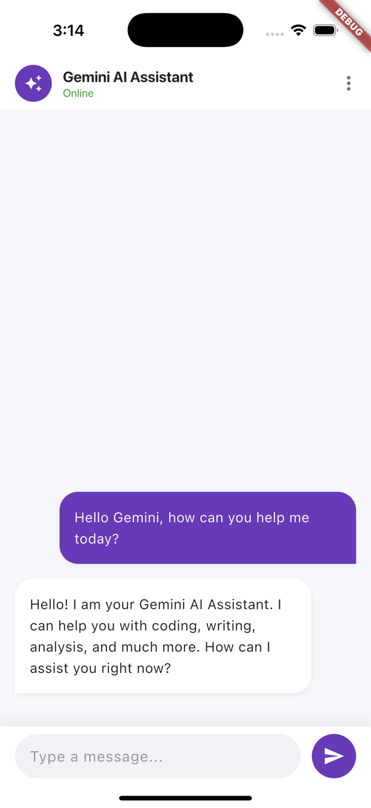

# AI-Chat (Gemini AI Assistant)

A modern AI chat application built with Flutter and Firebase AI (Gemini). This project demonstrates how to integrate Google's state-of-the-art Gemini models into a mobile application, providing a fluid, responsive, and "Good Taste" user experience.

## 📸 Screenshots

| Empty State | Chat Interface |
| :---: | :---: |
|  |  |

## ✨ Features

-   **Gemini 2.5 Flash Integration**: Leverages the latest Gemini models for high-speed, accurate AI interactions.
-   **Real-time Streaming Responses**: Implements Stream-based API for a smooth "typing" effect in conversations.
-   **Modern Material 3 UI**:
    -   Clean, bubble-style chat interface.
    -   Full Markdown rendering (including code blocks with syntax highlighting and inline images).
    -   Automatic bottom-scrolling with smooth animations.
    -   Responsive input area with physical keyboard support (Enter to send, Shift+Enter for newline).
    -   **AppBar Menu**: Convenient actions for clearing chat, copying messages, and viewing application details.
-   **Session Management**: Implements chat session handling and data persistence across restarts.
-   **Robust Architecture**: Utilizes the BLoC (Business Logic Component) pattern for clean, predictable state management.
-   **Dependency Injection**: Structured DI container for repository and bloc instance management.
-   **Localization (i18n)**: Multi-language support (English and Traditional Chinese) using `.arb` files.
-   **Strongly Typed Assets**: Utilizes `flutter_gen` for type-safe static assets and colors management.
-   **Modular UI Components**: Fully decoupled and reusable widget architecture.

## 🛠 Tech Stack

-   **Core Framework**: [Flutter](https://flutter.dev) (v3.10.8+)
-   **Language**: [Dart](https://dart.dev)
-   **State Management**: [flutter_bloc](https://pub.dev/packages/flutter_bloc) (v9.1.1)
-   **AI Engine**: [firebase_ai](https://pub.dev/packages/firebase_ai) (v3.7.0)
-   **Data Persistence**: `shared_preferences` for session state caching.
-   **UI & Utilities**:
    -   `flutter_markdown`: For rendering AI-generated Markdown content.
    -   `url_launcher`: Handling link interactions within the chat.
    -   `equatable`: Simplified value equality in BLoC states.
    -   `flutter_gen`: For strongly-typed assets.

## 🏗 Project Structure

The project follows a Feature-First, clean architecture approach:

```text
lib/
├── bloc/               # Core Business Logic (BLoC)
│   └── gemini_api/     # Gemini API communication, state, events & models
├── data/               # Data Layer & Repositories (Chat Repository)
├── di/                 # Dependency Injection setup
├── features/           # Reusable utils and foundation
├── generated/          # Auto-generated code (e.g., flutter_gen assets)
├── l10n/               # Localization files (.arb)
├── pages/              # UI Components & Pages
│   ├── ai_chat_page.dart # Primary Chat Interface Entry
│   └── widgets/        # Modular UI components (InputArea, MessageBubble, etc.)
└── main.dart           # Entry point & Firebase Initialization
```

## 🚀 Getting Started

### Prerequisites

1.  Ensure you have the Flutter SDK installed.
2.  Create a project in the [Firebase Console](https://console.firebase.google.com/).
3.  Enable the **Google AI (Gemini)** service.
4.  Download `google-services.json` (Android) and `GoogleService-Info.plist` (iOS) and place them in:
    -   `android/app/google-services.json`
    -   `ios/Runner/GoogleService-Info.plist`

### Running the Project

```bash
# Fetch dependencies
flutter pub get

# Run the application
flutter run
```

## 🤖 AI-Assisted Development Workflow

This project uses an automated multi-agent development workflow powered by Claude as orchestrator + the `agy` (antigravity-cli) delegation backend. Simply describe a feature and the orchestrator drives the entire cycle automatically, pausing only at key decision points.

> **Delegation backend:** `brancher`, `implementer`, and `publisher` delegate execution to `agy` (must be on `PATH`, default `~/.local/bin/agy`). When `agy` is unavailable, each agent falls back to running natively — the workflow still works, it just doesn't delegate.

> **Multiple workflows in parallel:** You can run several independent workflows on the same repo at once (multiple terminals / sessions). The isolation key is the **git branch** — each workflow runs on its own branch and writes its own per-branch state file under `.claude/workflow-state/`, so they never collide and need no lock. The only window needing extra handling is "both flows are still in STAGE 0a/0b (no branch yet)", which is disambiguated by a persisted **workflow-id**.

> **Optional Claude Workflow acceleration:** Three specific stages (0a context collection, STAGE 2 independent tasks, STAGE 3 multi-angle review) support opt-in `Workflow` fan-out for parallel execution. Pause points are always controlled by the main orchestrator outside any Workflow call. To opt-in, mention "ultracode", "用 workflow", or "多 agent".

```text
  User: "Build me feature X"
         │
         ▼
  ┌─────────────────────────────────────────────────────┐
  │  STAGE 0a: Feature Spec        [Planner — Opus]      │
  │  🟢 Parallel context collection (opt-in Workflow):   │
  │     A. Project context (README / pubspec / git log)  │
  │     B. Similar feature code survey                   │
  │     → Planner converges both into spec               │
  │  Produces docs/features/YYYY-MM-DD-<feature>.md      │
  │  (What & Why: user stories, acceptance criteria)     │
  │  ⏸ Pause: review spec → user confirms               │
  └────────────────────────┬────────────────────────────┘
                           │ confirmed
                           ▼
  ┌─────────────────────────────────────────────────────┐
  │  STAGE 0b: Implementation Plan [Planner — Opus]      │
  │  Produces docs/plans/YYYY-MM-DD-<feature>.md         │
  │  (How: data structures, file changes, task breakdown)│
  │  ⏸ Pause: review plan → user confirms               │
  └────────────────────────┬────────────────────────────┘
                           │ confirmed
                           ▼
  ┌─────────────────────────────────────────────────────┐
  │  STAGE 1: Branch Setup         [Sonnet]              │
  │  → gen-gh-issue skill produces Issue body            │
  │    (5-section zh-tw: Problem / Root cause / Fix /    │
  │     Out of scope / Verification)                     │
  │  → Brancher agent drafts branch name                 │
  │  ⏸ Pause: review Issue title/body + branch name     │
  │  agy executes: gh issue create + git checkout        │
  └────────────────────────┬────────────────────────────┘
                           │ confirmed
                           ▼
  ┌─────────────────────────────────────────────────────┐
  │  STAGE 2: Implementation       [dynamic per-task]    │
  │  Model picked per-task by complexity:                │
  │    mechanical → cheap | integration → standard       │
  │    design judgment / cross-layer → Opus              │
  │  🟢 Independent tasks may run in parallel            │
  │     (opt-in Workflow fan-out, path-disjoint only)    │
  │  agy writes code + tests + commits per task          │
  │  Claude performs 2-stage acceptance per task          │
  │  ⏸ Pause after each task/batch: show changed files  │
  │    + test results → user confirms next               │
  └────────────────────────┬────────────────────────────┘
                           │ all tasks confirmed
                           ▼
  ┌─────────────────────────────────────────────────────┐
  │  STAGE 3: Code Review          [Reviewer — Opus]     │
  │  Reviewer judges directly (never delegated to agy)   │
  │  🟢 Opt-in: multi-angle adversarial review           │
  │     (parallel verifiers per lens → reviewer merges)  │
  │  ⏸ Pause: show review report → user confirms        │
  │  ├─ Pass → proceed to STAGE 4                       │
  │  └─ Fail / user requests fix                        │
  │       → auto rollback to STAGE 2 → re-review        │
  └────────────────────────┬────────────────────────────┘
                           │ confirmed
                           ▼
  ┌─────────────────────────────────────────────────────┐
  │  STAGE 4: Publish PR           [Publisher — Sonnet]   │
  │  agy analyzes diff → generates PR draft               │
  │  Claude proofreads draft                             │
  │  ⏸ Pause: review PR draft → user confirms           │
  │  gh pr create → PR URL returned                     │
  │  (local branch is always preserved, never deleted)   │
  └────────────────────────┬────────────────────────────┘
                           │ PR created ✦ workflow stops

  ──────────────────────────────────────────────────────
  STAGE 5: PR Review Response (manually triggered)
  ──────────────────────────────────────────────────────
  Trigger: /gen-dev-workflow review #<PR>
  → Responder agent handles each inline comment
  → Reviewer agent re-reviews
  → Publisher agent updates PR
  → Workflow stops again
```

### Quick Commands

| Command | Stage | Action |
|---------|-------|--------|
| `/gen-dev-workflow` | — | Check workflow state / start new |
| `/gen-dev-workflow spec <description>` | 0a | Write feature spec |
| `/gen-dev-workflow plan <spec-path>` | 0b | Write implementation plan |
| `/gen-dev-workflow branch <issue>` | 1 | Create Issue + branch |
| `/gen-dev-workflow implement <plan-path>` | 2 | Run implementation |
| `/gen-dev-workflow code-review <branch>` | 3 | Run code review |
| `/gen-dev-workflow publish <branch>` | 4 | Create PR |
| `/gen-dev-workflow review #<PR>` | 5 | Handle PR review comments |

> **Token budget gate:** When main-conversation context exceeds ~150k tokens, the orchestrator checkpoints progress to the state file and prompts you to start a fresh session. Say `繼續` / `/gen-dev-workflow` to auto-resume from the saved stage.

> **Running parallel workflows:** open a new terminal/session for each feature. After STAGE 1 each lives on a distinct branch (state at `.claude/workflow-state/<branch-slug>.json`); say `繼續` / `/gen-dev-workflow` from the matching branch to resume the right one. Progress lines are prefixed with the branch slug (or `wf-id` before a branch exists) so concurrent outputs stay distinguishable.

---

## 📄 License

This project is licensed under the MIT License - see the [LICENSE](LICENSE) file for details.

---
Developed by Yomiry.
