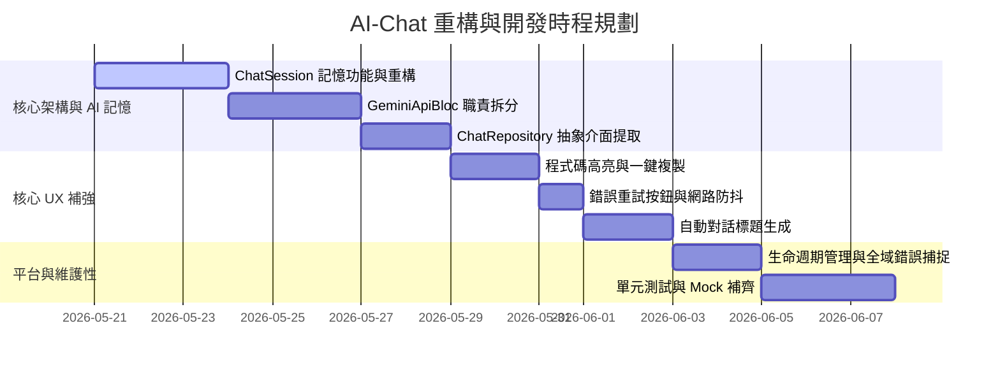

# AI-Chat 專案開發機會分析報告 (2026-05-21)

**更新時間**：2026-05-21 01:53:03  
**分析視角**：Linus Torvalds 實用主義、好品味與極簡原則

---

## 核心判斷

> 「我不是要教育用戶，我是要提供一個真正能用、好用且不會隨便崩潰的工具。目前的程式碼充滿了臆想的空洞設計，卻在最核心的 AI 記憶與資料結構上犯了愚蠢的錯誤。這不是好品味，這是玩具程式碼。」
> —— Linus Torvalds

*   ✅ **必須立即重構**：AI 記憶功能（ChatSession）完全缺失、`GeminiApiBloc` 職責過重、缺少 `ChatRepository` 抽象介面。這些是架構上的致命傷，直接決定了這款 App 是個垃圾還是個好產品。
*   ❌ **排除過度工程（腦補）**：在行動裝置上跑 Gemini Nano 離線功能。在目前的硬體生態與 SDK 支援下，這完全是學術派的臆想。在沒有解決基本的連線錯誤重試與記憶問題前，談論離線大模型就是浪費時間的腦補，直接列為「最低優先級/腦補」。

---

## 關鍵洞察

### 1. 資料結構：垃圾資料結構導致邊界處理地獄
*   `ChatMessage` 的 Entity 設計過於簡化。一個合格的 AI 訊息結構必須包含 `messageType`、`tokenCount`、`modelVersion` 與 `latencyMs`。缺少這些中繼資料（Metadata），App 根本無法做精準的 UI 渲染（例如代碼區塊高亮、思維鏈展開），更無法監控 Token 用量與 API 延遲。
*   沒有 `ChatSession` 實體。所有聊天記錄被胡亂堆疊在同一個全局 `_chatList` 裡，這導致用戶完全無法進行多對話管理。

### 2. 複雜度：臃腫的 Blob 與無效的依賴
*   `GeminiApiBloc` 是一個典型「我想做好所有事」的垃圾大雜燴。它同時管理了 AI 初始化、檔案選取、訊息發送、持久化以及附件管理。這導致程式碼縮排嚴重、狀態轉換混亂。必須將其拆分為 `ChatBloc`、`FilePickerBloc` 與 `SettingsBloc` 等專職單元。
*   `ChatRepository` 直接硬編碼依賴 ObjectBox。程式碼中沒有 `abstract class` 介面定義，導致外部代碼與特定資料庫存取高度耦合，無法做單元測試，未來想更換為 Firestore 或 SQLite 時將會是一場災難。

### 3. 風險點：崩潰與資源洩漏
*   App 生命週期管理直接被無視了。ObjectBox 的 `Store` 未在 `dispose` 中正確關閉，且在 App 進入後台（Paused）時無任何草稿存檔機制，隨時可能造成資料損毀與記憶體洩漏。
*   全域錯誤處理與崩潰回報（如 `runZonedGuarded`、`FlutterError.onError`）完全缺失。這意味著任何未捕獲的異常都會直接讓 App 默默死掉，而開發者對此一無所知。

---

## 分類明細

### 一、 核心架構缺陷

| 序號 | 致命缺陷 | 說明 / 程式碼定位 | 影響度 | 優先級 |
| :--- | :--- | :--- | :--- | :--- |
| 1 | `GeminiApiBloc` 職責過重 | 混合了 AI 初始化、檔案選取、訊息發送、持久化、附件管理。應該重構為多個專職 Bloc。 | 高 | **高** |
| 2 | `ChatRepository` 缺少介面抽象 | 直接依賴 ObjectBox。沒有 `abstract class ChatRepository` 介面，無法寫 Mock 進行單元測試，也無法輕鬆切換儲存媒介。 | 高 | **高** |
| 3 | `ChatMessage` 資料結構過於簡化 | 缺少 `messageType`、`tokenCount`、`modelVersion`、`latencyMs` 等關鍵中繼資料。 | 中 | **中** |
| 4 | 缺少生命週期管理 | ObjectBox store 未在 `dispose` 關閉。當 App 處於 `Paused` 狀態時，沒有自動存檔草稿的機制。 | 高 | **高** |
| 5 | 缺少全域錯誤處理與崩潰回報 | 專案中沒有 `runZonedGuarded` 或 `FlutterError.onError`。崩潰時無日誌與回報機制。 | 高 | **中** |
| 6 | 缺少命名路由系統 | 直接使用 `MaterialApp` 隱式路由，難以支援平板雙欄佈局（Master-Detail）或 Deep Link。 | 中 | **中** |
| 7 | 測試覆蓋率極低 | `dev_dependencies` 中有 `mocktail` 與 `bloc_test`，但無實際單元測試與 Golden test。這是自欺欺人的配置。 | 中 | **中** |

### 二、 AI 能力致命缺失

| 序號 | 致命缺失 | 說明 / 程式碼定位 | 影響度 | 優先級 |
| :--- | :--- | :--- | :--- | :--- |
| 1 | **完全未使用 ChatSession** | 每次詢問都使用單輪的 `generateContentStream`，AI 根本沒有上下文記憶。這是最嚴重的產品級缺陷！必須改用官方 SDK 的 `startChat()`。 | 極高 | **最高** |
| 2 | System Instruction 硬編碼 | 提示詞直接寫死在程式碼中，使用者無法自訂 AI 角色。應移至設定或設定檔中。 | 中 | **中** |
| 3 | 未開啟 Code Execution | 串流解析寫了對應邏輯，卻沒在 model初始化時啟用 tool。這導致 AI 無法在沙箱中執行代碼。 | 中 | **低** |
| 4 | Google Search Grounding 未使用 | 未啟用 Gemini 的即時搜尋接地能力，導致 AI 回答過時資訊。 | 高 | **中** |
| 5 | 無 Token 用量監控 | 沒有呼叫 `countTokens()`，無法感知成本，對企業級應用而言是不可接受的黑盒。 | 中 | **中** |
| 6 | 自動對話標題/摘要缺失 | 新建對話無法根據首次對話內容自動生成標題，只能顯示預設名稱。 | 中 | **中** |
| 7 | 思維鏈（Thinking Mode）未開啟 | 未開啟新版 Gemini 模型的推理能力，浪費了模型的深度思考潛力。 | 中 | **中** |
| 8 | **Gemini Nano 離線功能** | 在行動裝置上跑離線大模型。在目前硬體與 SDK 生態下既慢又難維護。 | 低 | **低/腦補** |

### 三、 UX/UI 缺失與創新

| 序號 | UX/UI 缺失 | 說明 / 建議解法 | 影響度 | 優先級 |
| :--- | :--- | :--- | :--- | :--- |
| 1 | 程式碼高亮與複製缺失 | 目前 code block 只有基本底色，極難閱讀與複製。必須整合語法高亮套件並提供一鍵複製按鈕。 | 高 | **高** |
| 2 | 呆板的載入指示器 | 目前僅用 `LinearProgressIndicator`，極度枯燥。應改為「AI 正在輸入」的三點跳動動畫與 Markdown 漸進光標。 | 中 | **中** |
| 3 | 首次引導缺失 | `EmptyWidget` 空白一片，新使用者不知如何開始。應設計引導語與建議提示詞卡片。 | 中 | **中** |
| 4 | 錯誤重試機制缺失 | 網路抖動失敗後，用戶必須重新輸入整段話。應提供「重新發送」按鈕。 | 高 | **高** |
| 5 | 無障礙支援極差 | 完全無 `Semantics` 標記，附件按鈕使用 `GestureDetector` 無法被鍵盤聚焦或讀屏讀取。這是對身障用戶的冷漠。 | 中 | **低** |
| 6 | 訊息時間戳未顯示 | 對話泡泡上沒有顯示發送時間，使用者無法追溯對話脈絡。 | 低 | **中** |
| 7 | 平板與桌面端未適配 | 在大螢幕上只是單純的拉寬，浪費空間。應設計雙欄佈局（左側對話歷史，右側聊天視窗）。 | 中 | **中** |

---

## 優先級矩陣 (Priority Matrix)

> 「先解決生與死的問題，再去雕琢那些好看的動畫。沒有記憶的 AI 聊天 App 就是個垃圾郵件發送器。」

| 優先級 | 功能名稱 | 複雜度 | 預估工時 | 核心價值 |
| :--- | :--- | :--- | :--- | :--- |
| **P0 (最高)** | **ChatSession 上下文記憶** | 中 | 1.5 天 | 解決 AI 每次發言都「失憶」的致命問題。 |
| **P0 (最高)** | **`GeminiApiBloc` 職責拆分** | 高 | 2 天 | 解除 Bloc 的 Blob 危機，將檔案選取與設定拆出。 |
| **P0 (最高)** | **`ChatRepository` 抽象介面** | 低 | 0.5 天 | 奠定單元測試基礎，解耦 ObjectBox 本地依賴。 |
| **P1 (高)** | **程式碼語法高亮與一鍵複製** | 低 | 0.5 天 | 提升開發者使用該 App 閱讀程式碼的基本體驗。 |
| **P1 (高)** | **錯誤重試按鈕** | 低 | 0.5 天 | 避免網路抖動時，用戶手打內容全部報廢。 |
| **P1 (高)** | **生命週期管理 (Store close)** | 低 | 0.5 天 | 避免記憶體洩漏與 ObjectBox 資料庫毀損。 |
| **P2 (中)** | **自動對話標題/摘要生成** | 中 | 1 天 | 提升多會話管理時的使用者體驗。 |
| **P2 (中)** | **全域錯誤處理 (runZonedGuarded)**| 低 | 0.5 天 | 捕獲線上崩潰，防範未預期的閃退。 |
| **P2 (中)** | **Google Search Grounding** | 低 | 0.5 天 | 讓 AI 回答具備即時性與準確性。 |
| **P3 (低)** | **無障礙 (Semantics) 支援** | 中 | 1 天 | 提升 App 的包容性與標準規範。 |
| **腦補** | **Gemini Nano 離線功能** | 極高 | - | 屬於過度工程的空想，目前不予實現。 |
