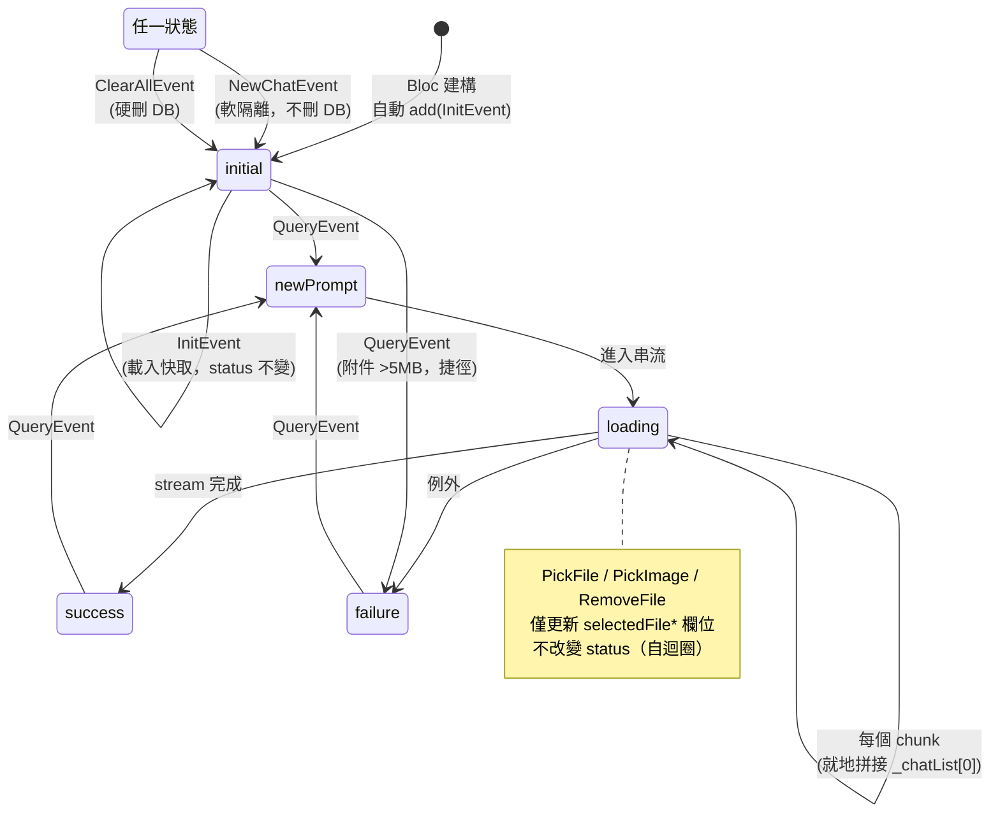
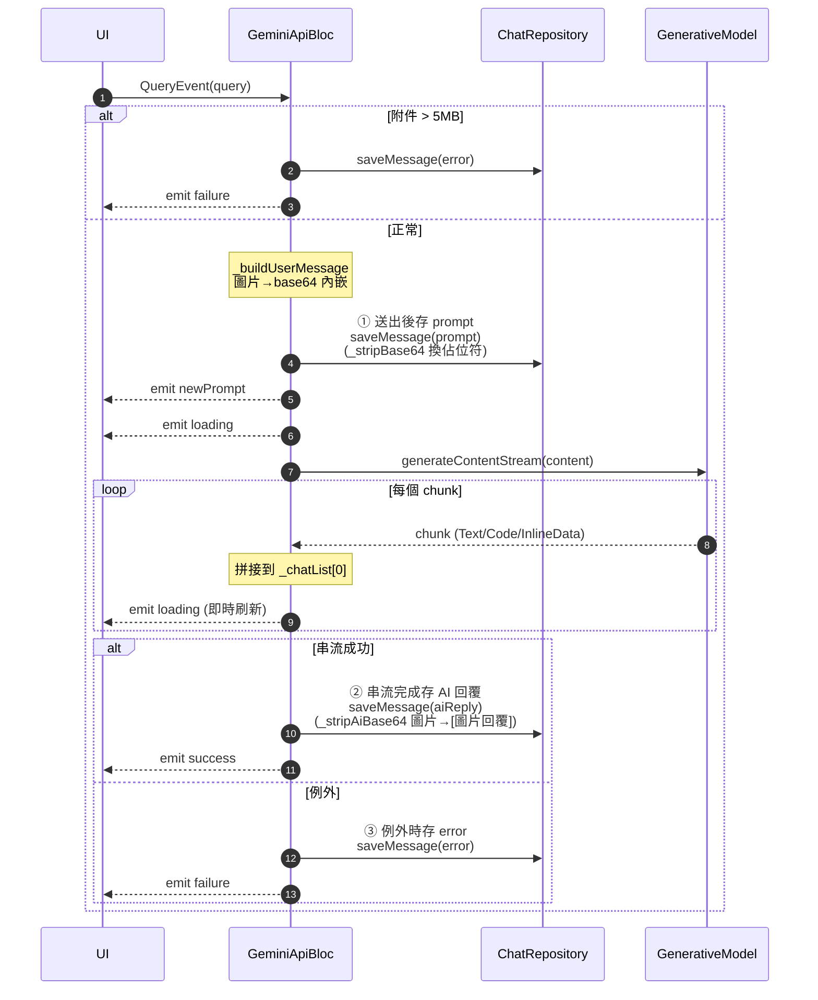
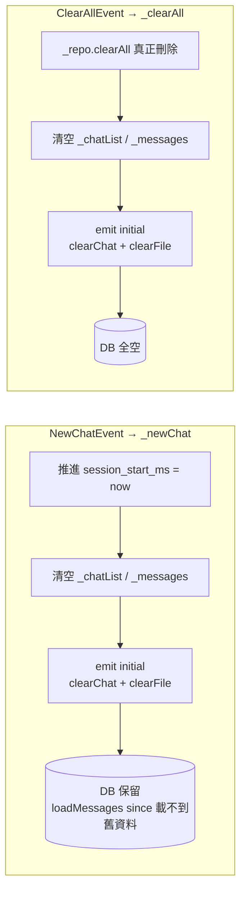

# GeminiApiBloc 狀態流程圖

> 視覺化文件：聚焦 **event → handler → state 轉換** 的圖解。
> Event payload、State 欄位、各 handler 的逐行處理細節見
> → [專案結構分析 · 第五章](../2026-05-31-project-structure-analysis.md)（5.1～5.4）。
>
> 對應原始碼：
> - `lib/bloc/gemini_api/gemini_api_bloc.dart`
> - `lib/bloc/gemini_api/gemini_api_event.dart`
> - `lib/bloc/gemini_api/gemini_api_state.dart`
> - `lib/bloc/status.dart`

---

## 1. Event → Handler → emit Status 對照表

`Status` enum 共 11 個值，本 Bloc 實際只用到 5 個：`initial / newPrompt / loading / success / failure`。

| Event | Handler | emit 的 Status 序列 | 動 DB |
|-------|---------|---------------------|-------|
| `GeminiApiInitEvent` | `_init` | （維持 `initial`） | 只讀 |
| `GeminiApiQueryEvent` | `_query` | `newPrompt` → `loading`…（逐 chunk） → `success` ／ `failure` | 寫（①②③） |
| `GeminiApiPickFileEvent` | `_pickFile` | （無 status，僅更新附件）／ `failure`（取消） | 不動 |
| `GeminiApiPickImageEvent` | `_pickImage` | （無 status，僅更新附件）／ `failure`（取消） | 不動 |
| `GeminiApiRemoveFileEvent` | `_removeFile` | （無 status，`clearFile`） | 不動 |
| `GeminiApiNewChatEvent` | `_newChat` | `initial`（`clearChat`+`clearFile`） | 不刪（軟隔離） |
| `GeminiApiClearAllEvent` | `_clearAll` | `initial`（`clearChat`+`clearFile`） | 全刪 |

> `_query` 的附件大小檢查（>5MB）會走捷徑直接 emit `failure` 並 return，不進入串流。

**①②③ 圖例**（`_query` 的三個 DB 落地時機，對應 `gemini_api_bloc.dart` 內同名註解，後續各圖共用）：

| 記號 | 時機 | 寫入內容 | 原始碼 |
|------|------|----------|--------|
| ① | 使用者送出後 | `saveMessage(prompt)`，`_stripBase64` 把 base64 換成佔位符 | `gemini_api_bloc.dart:117-119` |
| ② | 串流全數完成後 | `saveMessage(aiReply)`，`_stripAiBase64` 把圖片換成 `[圖片回覆]`（Gemini 空回覆則略過） | `gemini_api_bloc.dart:184-191` |
| ③ | 例外時 | `saveMessage(error)`，落地錯誤訊息 | `gemini_api_bloc.dart:210-212` |

> 三個記號代表三種結局各有一個持久化點——成功或失敗都不漏存。

---

## 2. 整體狀態機

以 `Status` 為節點，event 為轉移邊。`_pickFile`/`_pickImage`/`_removeFile` 只改 `selectedFile*` 欄位、不改 `status`（成功時），故畫成自迴圈。



---

## 3. `_query` 主路徑時序

`_query` 是唯一的多段 emit 流程，且分三個落地時機寫入 DB：**① 送出後存 prompt、② 串流完成存 AI 回覆、③ 例外時存 error**。



> 設計重點：DB 存「瘦身版」（base64 換成佔位符）；UI 的 `_chatList` 保留完整 base64 供當下渲染。細節見結構分析文件 5.4。

### 3.1 `_query` 區塊圖（純文字，不需渲染）

以方塊串接 `_query` 的處理階段，框內列出該階段對 **記憶體欄位 / DB / emit** 的動作，邊上標分支條件。

```text
              QueryEvent(query)
                     │
                     ▼
    ┌─────────────────────────────────────────────┐
    │  STEP 0：附件大小檢查                         │
    │  讀 state.selectedFileBytes / selectedMimeType│
    └───────────────────┬─────────────────────────┘
            > 5MB ┌─────┴─────┐ ≤ 5MB（或無附件）
                  ▼           ▼
    ┌──────────────────┐  ┌─────────────────────────────────┐
    │ 捷徑：拒絕         │  │  STEP 1：組使用者訊息             │
    │ _chatList 插 prompt│  │  _buildUserMessage               │
    │  + error 兩則      │  │  圖片→base64 內嵌 / 其他→描述文字 │
    │ saveMessage(err)   │  └───────────────┬─────────────────┘
    │  （存 error 訊息） │                  ▼
    │ emit failure       │  ┌─────────────────────────────────┐
    │ return ────────────┼─►│  STEP 2：① 送出後存 prompt       │
    └──────────────────┘    │  _stripBase64 → 佔位符           │
                            │  saveMessage(prompt)  ← DB 寫    │
                            │  _chatList / _messages insert(0) │
                            │  emit newPrompt                  │
                            └───────────────┬─────────────────┘
                                               ▼
                               ┌─────────────────────────────────┐
                               │  STEP 3：進入串流                │
                               │  emit loading                    │
                               │  _buildContent（text / multi）   │
                               │  generateContentStream(content)  │
                               └───────────────┬─────────────────┘
                                               ▼
                          ┌────────────────────────────────────────┐
                          │  STEP 4：await for 逐 chunk（迴圈）      │
                          │  Text/Code/CodeResult/InlineData(圖片)   │
                          │  就地拼接 _chatList[0]                   │
                          │  _removeFile（清掉已送附件）             │
                          │  emit loading（每 chunk 刷新 UI）  ◄─┐   │
                          └───────────────┬───────────────────┘   │
                                          │   還有 chunk ──────────┘
                                完成 / 例外 │
                  ┌───────────────────────┴───────────────────────┐
                  ▼ 串流完成                                 例外 ▼
    ┌─────────────────────────────────┐   ┌─────────────────────────────────┐
    │  STEP 5a：② 串流完成存 AI 回覆   │   │  STEP 5b：③ 例外時存 error       │
    │  _stripAiBase64 → [圖片回覆]     │   │  saveMessage(error)   ← DB 寫    │
    │  saveMessage(aiReply) ← DB 寫    │   │  _messages / _chatList insert(0) │
    │  _messages insert(0)             │   │  emit failure                    │
    │  （Gemini 空回覆則略過落地）      │   └─────────────────────────────────┘
    │  emit success                    │
    └─────────────────────────────────┘
```

> 三個 DB 落地時機：**① 送出後存 prompt、② 串流完成存 AI 回覆、③ 例外時存 error**（對應原始碼註解）；不論成功或例外都有持久化。
> 註：STEP 0 捷徑那則 `saveMessage(err)` 是附件超限的錯誤落地，性質同 ③（存 error），不另編號。

### 3.2 其餘 6 個 event 區塊圖

`_query` 以外的 handler 都是單段流程，框內標 **讀 / 改記憶體欄位 / DB / emit** 四要素。

```text
  InitEvent                          PickFileEvent
  （建構子自動 add）                  （點「附加檔案」）
       │                                   │
       ▼                                   ▼
┌──────────────────────────┐   ┌──────────────────────────────────┐
│ _init                    │   │ _pickFile                        │
│ 讀 prefs[session_start_ms]│   │ 讀 FilePickManager.pickFile()    │
│ _repo.loadMessages(since) │   │ ┌ 取消/空 → emit failure         │
│   ← DB 只讀               │   │ │           + clearFile          │
│ 重建 _messages / _chatList│   │ ├ bytes 仍 null → return（不emit）│
│ _initFirebaseAiLogic      │   │ └ 否 → emit(selectedFileBytes,   │
│   建 _aiModel            │   │        selectedMimeType)         │
│ emit(chatList/messages    │   │ DB：不動                         │
│  空則傳 null；status不變) │   └──────────────────────────────────┘
└──────────────────────────┘

  PickImageEvent                     RemoveFileEvent
  （點「附加圖片」）                  （移除附件 / _query 內部自呼）
       │                                   │
       ▼                                   ▼
┌──────────────────────────────────┐   ┌──────────────────────────┐
│ _pickImage                       │   │ _removeFile              │
│ 讀 pickImageWithPermission(      │   │ emit(clearFile: true)    │
│     onPermissionDenied)          │   │   僅清空待送附件          │
│ ┌ null（取消/拒絕）→ emit failure │   │ DB：不動                 │
│ │              + clearFile       │   │ _chatList/_messages 不動 │
│ └ 否 → emit(selectedFileBytes,   │   └──────────────────────────┘
│        selectedMimeType)         │
│ DB：不動                         │
└──────────────────────────────────┘

  NewChatEvent                       ClearAllEvent
  （「新對話」）                      （「清空全部」）
       │                                   │
       ▼                                   ▼
┌──────────────────────────────────┐   ┌──────────────────────────────────┐
│ _newChat                         │   │ _clearAll                        │
│ 寫 prefs[session_start_ms]=now() │   │ _repo.clearAll() ← DB 全刪        │
│ _chatList=[] / _messages=[]      │   │ _chatList=[] / _messages=[]      │
│ emit(initial,                    │   │ emit(initial,                    │
│   clearChat+clearFile)           │   │   clearChat+clearFile)           │
│ DB：不刪（軟隔離：新 session     │   │ （emit 與 _newChat 完全相同，    │
│   loadMessages(since) 載不到舊） │   │   差別僅在真的刪 DB → 見第 4 節） │
└──────────────────────────────────┘   └──────────────────────────────────┘
```

> 觀察：`_pickFile` / `_pickImage` 結構幾乎相同（差在來源 API 與權限 callback）；
> `_newChat` / `_clearAll` emit 完全相同，差別只在 DB——這對比放大成獨立流程圖見第 4 節。

---

## 4. `_newChat` vs `_clearAll`（emit 相同，DB 不同）

兩者 emit 完全相同的 state，差別只在是否真的刪 DB。



---

## 維護備忘

- **新增 event**：更新第 1 節對照表 + 第 2 節狀態機 + 第 3.2 節區塊圖。
- **改 `_query` 串流流程**：更新第 3 節時序圖 + 第 3.1 節區塊圖。
- **改其他 handler 的 emit / DB 行為**：更新第 3.2 節對應方塊。
- **啟用目前未使用的 `Status`**（`empty` / `noInternetConnection` / 4xx / `serverError`）：在第 2 節補對應轉移邊。
